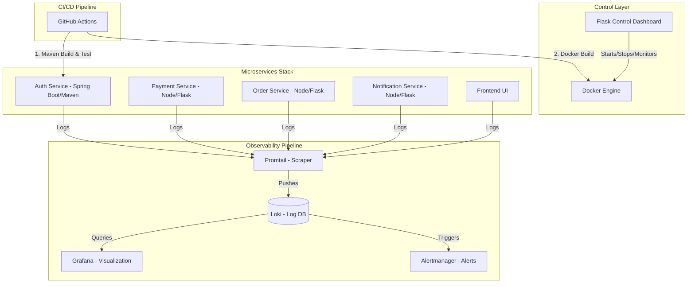
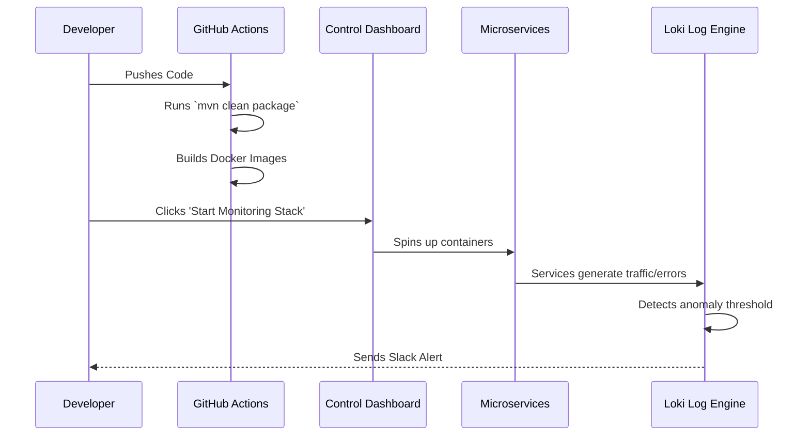

# Phase 1: Project Planning & Architecture

## 1. Project Title
**Smart Observability & Log Intelligence Platform using Grafana Stack, Maven, Docker & CI/CD Automation**

## 2. Problem Statement
Managing and monitoring enterprise microservices is difficult without a centralized automation strategy. Developers struggle with manual log checks, disconnected services, and a lack of real-time alerting. Furthermore, operating these stacks usually requires heavy terminal usage, making it intimidating for beginners. 

## 3. Objectives
- **Centralized Control Center**: Build a UI Dashboard to control the entire Docker Compose stack with one click.
- **Enterprise Standards**: Implement at least one microservice using **Java Spring Boot and Maven** to meet industry and academic enterprise standards.
- **Log Intelligence**: Aggregate logs dynamically using Loki and Promtail.
- **Anomaly Detection**: Use Grafana and Alertmanager to automatically detect error spikes and failures.
- **Full Automation**: Implement a CI/CD pipeline using GitHub Actions that tests Maven builds, packages JARs, and pushes Docker images.

## 4. Architecture Diagram


## 5. Workflow Diagram (Full Lifecycle)


## 6. Repository Setup & Folder Structure
```text
smart-observability-platform/
├── apps/
│   ├── auth-service/        # Spring Boot + Maven
│   ├── payment-service/     # Node.js or Flask
│   ├── order-service/       # Node.js or Flask
│   ├── notification-service/# Node.js or Flask
│   └── frontend/            # React or simple UI
├── monitoring/
│   ├── grafana/
│   ├── loki/
│   ├── promtail/
│   └── alertmanager/
├── control-dashboard/       # Flask + Bootstrap Automation UI
├── dashboards/              # Version-controlled Grafana JSONs
├── alerts/                  # Alertmanager rules
├── scripts/                 # Bash/PowerShell automation
├── docs/                    # Academic Reports & Viva Prep
├── .github/workflows/       # CI/CD pipelines
├── docker-compose.yml       # Main orchestration file
└── README.md
```

## 7. Branching & Commit Strategy
- **Branching**: 
  - `main`: Production-ready code.
  - `dev`: Active development integration.
  - `feature/maven-auth`, `feature/control-dashboard`: Specific feature branches.
- **Commit Strategy (Conventional Commits)**:
  - `feat:` New features (`feat: add spring boot auth service`)
  - `fix:` Bug fixes (`fix: resolve maven dependency issue`)
  - `docs:` Documentation (`docs: update architecture diagrams`)
  - `ci:` CI/CD pipelines (`ci: add github actions maven workflow`)

## 8. Technology Concepts (Beginner-Friendly)
- **Maven**: A build automation tool primarily used for Java projects. It reads a `pom.xml` file to automatically download libraries (dependencies) and compile Java code into a runnable `.jar` file.
- **Spring Boot**: A powerful Java framework that allows us to build standalone, production-grade enterprise microservices quickly.
- **Control Dashboard**: Instead of typing `docker-compose up` or checking logs in the terminal, we are building a web UI to click buttons that run these background commands for us.
- **CI/CD**: "Continuous Integration / Continuous Deployment". It means having a robot (GitHub Actions) test our Java code and build our Docker images automatically so we don't accidentally break production.
